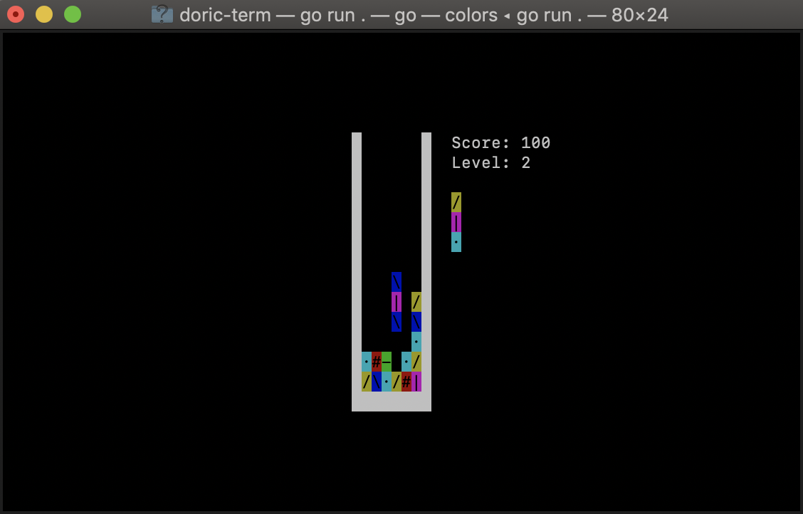

# Doric

A [Columns](https://en.wikipedia.org/wiki/Columns_(video_game)) game implementation.

## Features

* The classic SEGA arcade game in glorious ASCII.
* Game logic completely isolated from presentation, concurrent-safe. [pkg/columns](pkg/columns) library can be used in other implementations with minimal effort. Check https://godoc.org/github.com/svera/doric/pkg/columns for reference and examples.

## Build from sources

### Requirements

* Go 1.11 or higher

### Instructions

 1. In a terminal, run `go get github.com/svera/doric`
 2. From the source code directory, run `go install ./cmd/doric-term` (build) or `go run ./cmd/doric-term` (build and run).

## How to play

The objective of the game is to get the maximum possible score. To do that, player must eliminate falling pieces from the pit, aligning
3 or more tiles of the same color vertically, horizontally or diagonally. Every 10 tiles removed the falling speed increases slightly.

### Controls

* **Left** or **right**: Move the current falling piece to the left or to the right
* **Down**: Move the current falling piece down
* **Tab**: Rotate piece
* **P**: Pause
* **Ctrl-c**: Quit

## Acknowledgments
* [Joel Auterson](https://github.com/JoelOtter) for [TermLoop](https://github.com/JoelOtter/termloop) framework