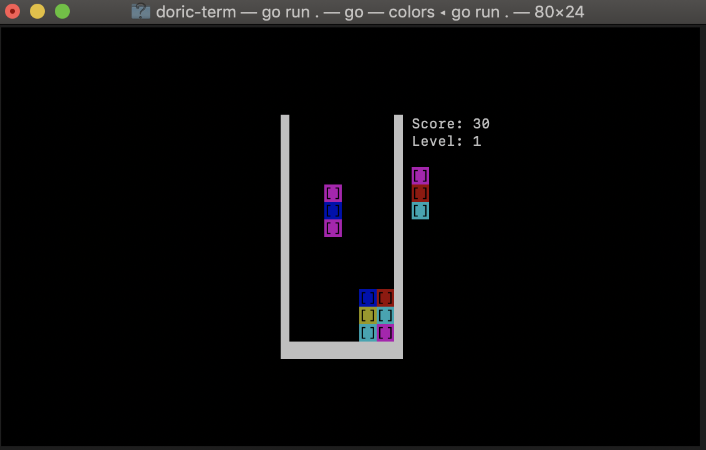

# Doric
[](https://travis-ci.com/svera/doric)
[](https://goreportcard.com/report/github.com/svera/doric)
[](https://coveralls.io/github/svera/doric?branch=master)

A [Columns](https://en.wikipedia.org/wiki/Columns_(video_game)) game implementation written by Sergio Vera.



## Features

* The classic SEGA arcade game in glorious ASCII.
* Game logic completely isolated from presentation, running in its own thread. [pkg/columns](pkg/columns) library can be used in other implementations with minimal effort. Basically:
```go
    package main

    import "github.com/svera/doric/pkg/columns"

    func main() {
        events := make(chan int)
        pit := columns.NewPit(13, 6)
        player := columns.NewPlayer(pit)
        // Start the game and return game events in the events channel
        go player.Play(events)

        // Here you would need to start the game loop, manage input,
        // show graphics on screen, etc.

        // Listen for game events and act accordingly
        go func() {
            for {
                select {
                case ev := <-events:
                    if ev == columns.Finished {
                        // Do whatever
                        return
                    }
                    if ev == columns.Scored {
                        // Do whatever
                    }
                }
            }
    	}()
    }
```

## Build from sources

### Requirements

* Go 1.11 or higher

### Instructions

 1. In a terminal, run `go get github.com/svera/doric`
 2. From the source code directory, run `go install ./cmd/doric-term` (build) or `go run ./cmd/doric-term` (build and run).

## How to play

The objective of the game is to get the maximum possible score. To do that, player must eliminate falling pieces from the pit, aligning
3 or more tiles of the same color vertically, horizontally or diagonally. Every 10 tiles removed the falling speed increases slightly.

### Controls

* **Left** or **right**: Move the current falling piece to the left or to the right
* **Down**: Move the current falling piece down
* **Tab**: Rotate piece
* **P**: Pause
* **Ctrl-c**: Quit

## Acknowledgments
* [Joel Auterson](https://github.com/JoelOtter) for [TermLoop](https://github.com/JoelOtter/termloop) framework