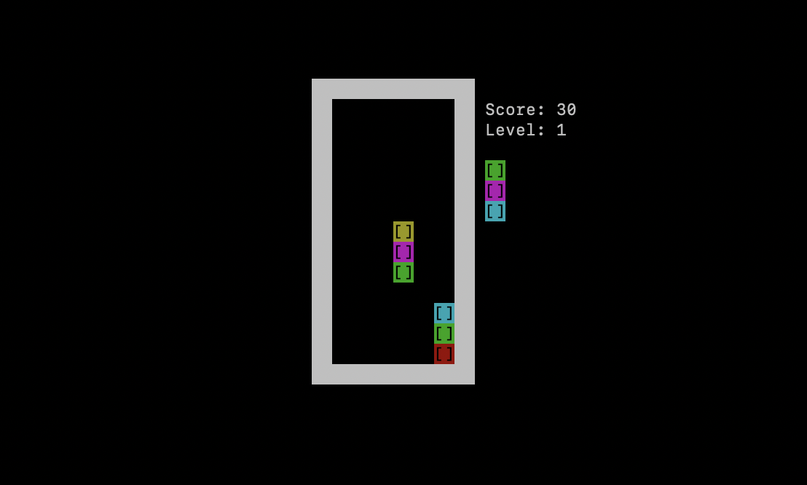

# Doric example implementation

### Requirements

* Go 1.11 or higher

### Instructions

 1. In a terminal, run `go get github.com/svera/doric`
 2. If you want to play the example implementation, run `go install ./examples` (build) or `go run ./examples` (build and run).

## How to play

The objective of the game is to get the maximum possible score. To do that, player must eliminate falling columns from the well, aligning
3 or more tiles of the same color vertically, horizontally or diagonally. Every 10 tiles removed the falling speed increases slightly.

### Controls

* **Left** or **right**: Move the current falling column to the left or to the right
* **Down**: Move the current falling column down
* **Tab**: Rotate column
* **P**: Pause
* **Ctrl-c**: Quit

## Acknowledgments
* [Joel Auterson](https://github.com/JoelOtter) for [TermLoop](https://github.com/JoelOtter/termloop) framework